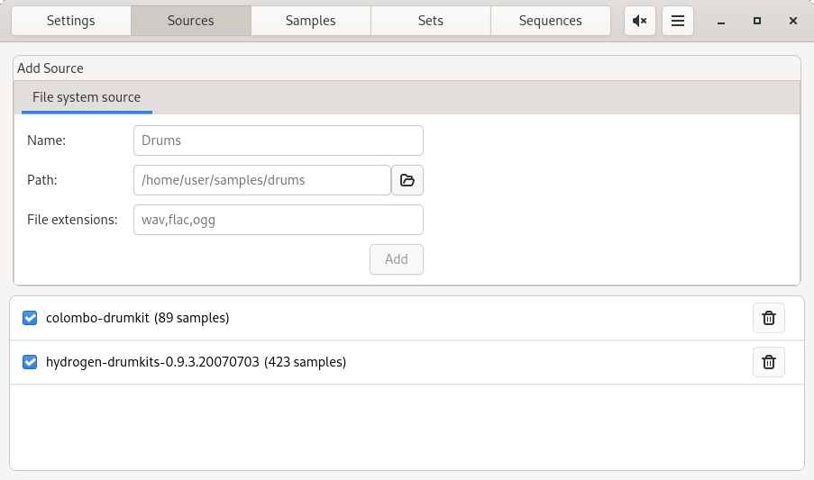
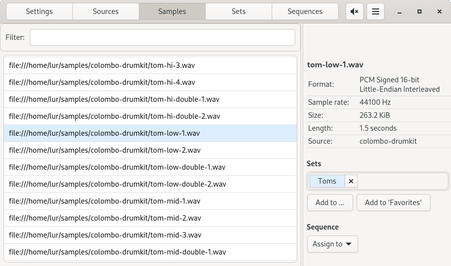
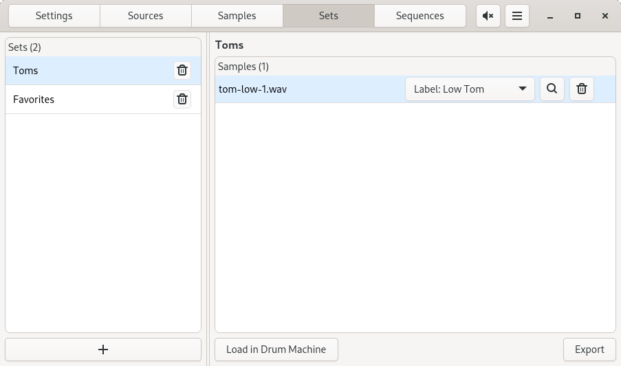
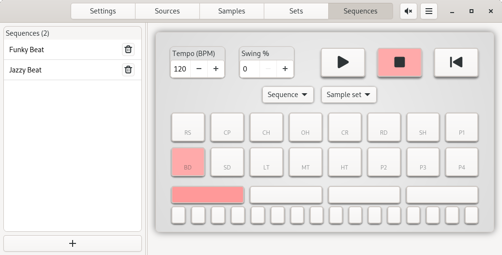

# Asampo: Audio Sample Organizer

Main features:
- Work with any number of sample sources (plain folders only at this time).
- Quickly filter/search many thousands of samples.
- Audio output runs constantly, no hiccups when previewing samples.
- Organize samples into named sets.
- Export sample set to single location, optionally with conversion.
- Load individual samples or full sets into drum machine.
- Program sequences in drum machine, save and load named sequences.
- Use drum machine to preview full sets of samples using a suitable sequence.
- Or just use the drum machine for fun!
- Saving and loading of workspaces (sources + sets + sequences).
- No destructive features, except for exporting a sample set to an existing folder.
- 🦀 Blazingly fast (maybe).

## Requirements
Asampo currently only runs on Linux using PulseAudio (runs great on `pipewire-pulse`).

## Installation
Build with `cargo` and then `cargo run`, or use a [Flatpak or AppImage](releases).

## Sources
Add, remove, and toggle sources:

## Samples
Filter, play, and assign samples to sets or a drum machine pad.

## Sets
Manage sets, assign drum pad labels, load in drum machine or export to single location:

## Sequences
Program sequences using a familiar drum machine interface:

# Roadmap
- [ ] Decent test coverage.
- [ ] JACK audio support.
- [ ] Windows support.
- [ ] AKAI Sample CD source type.
- [ ] Zip file / other archives source type?
- [ ] MIDI support?
- [ ] User manual.
